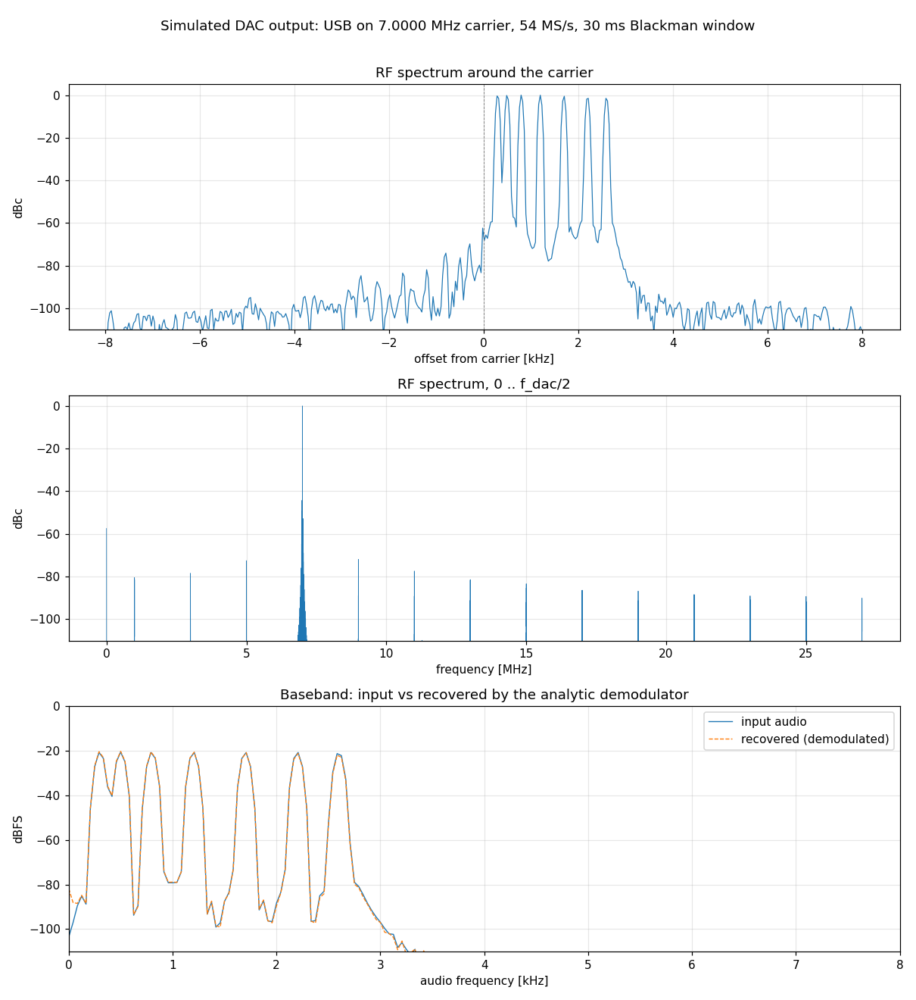

# Tang Nano 9K + ACM9767 dual DAC generator

Gowin GW1NR-9C (Sipeed Tang Nano 9K) gateware that drives an **ACM9767**
high-speed DAC module (Analog Devices AD9767, 2 x 14-bit, up to 125 MSPS,
+-5 V outputs) as a two-channel arbitrary-frequency signal generator, with
host control over the board's USB UART using Modbus RTU.

* Two independent DDS channels: sine (4096-point quarter-wave ROM), triangle, sawtooth,
  square with programmable duty, or DC; 32-bit frequency tuning word
  (sub-Hz resolution), 16-bit phase offset, amplitude, signed DC offset and
  per-channel polarity inversion.
* DAC sample clock from the on-chip PLL (54 MHz by default, set in
  `platform.json`), forwarded to the module as CLK and WRT through ODDR with
  the data transitions centred on the WRT latch edge and CLK half a period
  ahead of it.
* Modbus RTU slave on `/dev/ttyGowin` (1 Mbaud 8-E-1, id 7); all channel
  settings are staged in holding registers and applied atomically by a COMMIT.
* **SSB, AM and FM modulation of audio streamed from the PC**: 16 kS/s 16-bit samples go
  over the same Modbus link into a 2048-sample FIFO; a 127-tap Hilbert
  transformer + 3-stage CIC interpolator build the analytic baseband, mixed
  onto channel 1's DDS carrier (USB or LSB); the same baseband also drives AM
  (settable depth, carrier at half scale) and FM (settable deviation, 5 kHz
  NFM default, phase-accumulator modulation). Simulated unwanted-sideband and
  carrier suppression: better than 80 dB (the DAC and the module's analogue
  stage will set the real figure).
* `scripts/acm9767_ctl.py` -- host CLI in physical units (Hz, fraction of full
  scale, degrees); `stream` sends a WAV file or test tones as SSB.
* Icarus Verilog test suite (unit + an end-to-end Modbus-to-DAC test through
  the real top level with the Gowin PLL/ODDR models), driven by CTest; host
  tests with pytest against a fake slave; and a **modulator-to-demodulator
  loopback** (`ctest -L loopback`): the real modulator chain is simulated on
  a binary audio file, its 54 MS/s DAC codes are dumped as binary and decoded
  by an analytic-signal demodulator in Python (`scripts/ssb_loopback.py`),
  which scores SNR, sideband and carrier suppression for USB/LSB/AM/FM.

The build/test/program flow and the sim harness are lifted from
[tang_nano_9K_ov7670](https://github.com/phoenix367/tang_nano_9K_ov7670), as
are the UART and Modbus RTU slave cores.

## Prerequisites

| Component                    | Notes                                                             |
| ---------------------------- | ----------------------------------------------------------------- |
| Gowin EDA `V1.9.12.x` Linux  | IDE + Programmer. Needed even for simulation (`simlib/gw1n/prim_tsim.v`) |
| Icarus Verilog 12+           | `apt install iverilog`                                            |
| CMake 3.16+                  | `apt install cmake`                                               |
| Python 3.10+ (+ pyserial)    | host CLI; `pip install -r scripts/requirements.txt`               |

## Build, test, program

```sh
cmake -S . -B build -D IVerilog_PATH=/usr/bin -D Gowin_PATH=/opt/Gowin_V1.9.12.02_SP2_linux/IDE
cmake --build build                 # compile every testbench
(cd build && ctest)                 # run the simulation suite
cmake --build build --target hw_all       # synthesis + PnR + bitstream -> impl/pnr/acm9767_demo.fs
cmake --build build --target hw_program   # load into SRAM (volatile)
cmake --build build --target hw_program_flash   # persist in embedded flash
```

`Gowin_PATH` must be the IDE folder (the one with `bin/GowinSynthesis` and
`simlib/`). The four `loopback_*` tests take ~100 s each (they simulate
40 ms of audio at 54 MS/s); `ctest -LE loopback` runs the quick suite. Run
one by hand, e.g. with a real recording and the recovered audio written out:

```sh
scripts/ssb_loopback.py --sim build/sim/tests/unit/ssb_baseband/loopback/unit_ssb_baseband_loopback.bin \
    --mode lsb --carrier 7.1e6 --wav voice.wav --seconds 0.1 --save-wav --workdir build/loopback/voice
``` Other targets: `hw_synth`, `hw_impl`, `sine_lut` (regenerate the
sine ROM), per-test `<name>_BUILD` / `<name>_SIM`. Configure options:
`-D DUMP_SIM_VARIABLES=ON` writes `dump.vcd` per test, `-D SimLogLevel=Debug`
raises the testbench verbosity.

On Linux install `udev/99-gowin-ft2232h.rules` once so the programmer can open
the JTAG channel and the UART shows up as `/dev/ttyGowin`:

```sh
sudo install -m 644 udev/99-gowin-ft2232h.rules /etc/udev/rules.d/
sudo udevadm control --reload-rules   # then replug the board
```

## Wiring

See [doc/wiring.md](doc/wiring.md) for the pin table. Short version: only
channel 1 is wired -- data on left-header pins 25 26 27 28 29 30 33 34 40 35
41 42 51 53, CLK1 on 54, WRT1 on 55. All are 3.3 V pins; the 1.8 V pins 79-86
must not be used for the DAC. Remap by editing `src/acm9767.cst`; channel 2
comes back with `dac.channels = 2` in `platform.json` plus the commented
`da2_*` block in the constraints.

## Host control

```sh
scripts/acm9767_ctl.py status
scripts/acm9767_ctl.py set 1 --freq 1e6 --wave sine --amp 1.0
scripts/acm9767_ctl.py set 2 --freq 100e3 --wave square --duty 0.25 --offset 0.1
scripts/acm9767_ctl.py enable 1 2
scripts/acm9767_ctl.py invert 1 --on        # if the output polarity is backwards
scripts/acm9767_ctl.py read 0x10 7          # raw registers
```

```sh
scripts/acm9767_ctl.py stream --carrier 7.1e6 --tone 1000 --seconds 5   # 1 kHz tone as USB on 7.1 MHz
scripts/acm9767_ctl.py stream --carrier 7.1e6 --lsb --wav voice.wav     # a WAV file (any rate/channels) as LSB
scripts/acm9767_ctl.py stream --tone 700 --tone2 1900 --level 0.45      # two-tone test on the current carrier
scripts/acm9767_ctl.py stream --carrier 1e6 --mode am --depth 0.8 --wav voice.wav    # AM
scripts/acm9767_ctl.py stream --carrier 10.7e6 --mode nfm --tone 1000            # NFM, 5 kHz deviation
scripts/acm9767_ctl.py set 1 --freq 1e6 --wave am --depth 0.5                    # mode without streaming
```



*Simulated DAC output for seven tones (300-2600 Hz) as USB on a 7 MHz
carrier: the wanted sideband at 0 dBc, the suppressed sideband and carrier
below -60 dBc, the 1 MHz-spaced quantisation comb below -70 dBc across the
band, and the demodulated baseband overlaying the input. Reproduce with
`scripts/ssb_loopback.py` followed by `scripts/plot_spectrum.py`.*

`set` writes the channel block with one FC10 and commits; `--no-commit`
stages only. `stream` resamples the audio to the device's rate (register
0x0A), pushes 96-sample FC16 blocks into the FIFO window while pacing on
FIFO_LEVEL, and reports underruns at the end. The modulator removes DC from the audio, fades a (re)started stream in over 64 ms and limits the SSB envelope just below full scale, so `--level` is a loudness setting rather than a clipping margin (a hot recording is limited, not clipped); `--carrier` switches channel 1
to the `--mode` (usb, lsb, am, fm/nfm) on that carrier and enables it first. Audio bandwidth
is ~300 Hz .. 5 kHz (Hilbert transformer + CIC droop, -1.5 dB at 3 kHz);
carriers up to ~20 MHz are usable at the default 54 MHz sample clock. The tool reads the DAC sample clock from the device (registers
0x05/0x06) to compute tuning words, so it follows whatever `platform.json`
the bitstream was built with.

### Register map

16-bit Modbus holding registers (FC03 read, FC06 / FC10 write), slave id 7.

| Addr | Name        | R/W | Meaning                                                        |
| ---- | ----------- | --- | -------------------------------------------------------------- |
| 0x00 | ID          | R   | 0x9767                                                         |
| 0x01 | VERSION     | R   | 0x0100 (major.minor)                                           |
| 0x02 | STATUS      | R   | bit0 PLL locked, bit1 commit pending/in flight                 |
| 0x03 | CONTROL     | RW* | bit0/1 enable ch1/ch2, bit2/3 invert ch1/ch2                   |
| 0x04 | COMMIT      | W   | any write applies the staged bank; reads bit0 = busy           |
| 0x05 | DAC_CLK_LO  | R   | DAC sample clock in Hz, low word                               |
| 0x06 | DAC_CLK_HI  | R   | high word                                                      |
| 0x07 | CHANNELS    | R   | DAC channels wired in this bitstream (1 or 2)                  |
| 0x08 | FIFO_LEVEL  | R   | audio samples buffered                                         |
| 0x09 | UNDERRUNS   | R/W | audio ticks that found the FIFO empty; any write clears        |
| 0x0A | AUDIO_RATE  | R   | baseband sample rate, Hz (16000)                               |
| 0x0B | FIFO_DEPTH  | R   | FIFO capacity in samples (2048)                                |
| 0x100-0x17F | AUDIO | W  | FIFO write window: every register written pushes one signed 16-bit sample (FC16 streams a block) |
| 0x10 | CH1 block   | RW* | channel 1, 7 registers (below)                                 |
| 0x20 | CH2 block   | RW* | channel 2, same layout (drives nothing when CHANNELS = 1)      |

Channel block offsets: +0 `FTW_LO`, +1 `FTW_HI` (f_out = FTW x f_dac / 2^32),
+2 `PHASE` (2 pi / 65536 units), +3 `AMPLITUDE` (gain = (v+1)/65536, 0xFFFF =
unity), +4 `OFFSET` (signed, DAC LSBs, saturating), +5 `WAVEFORM` (0 sine,
1 triangle, 2 sawtooth, 3 square, 4 DC, 5 SSB upper sideband, 6 SSB lower
sideband, 7 AM, 8 FM -- modes 5..8 use the channel's FTW as the carrier and the
streamed audio as baseband), +6 `DUTY` (square high threshold, 0x8000 = 50 %),
+7 `MODPARAM` (AM: depth, 0xFFFF = 100 %; FM: peak deviation at full-scale
audio in units of 256 FTW steps, i.e. Hz x 2^32 / f_dac / 256 -- 5 kHz at
54 MHz is 1553). AM puts the unmodulated carrier at half scale so 100 % depth
peaks at full scale. `*` = staged until COMMIT. Addresses up to 0x17F are valid; anything else returns a
Modbus illegal-address exception.

## Repository layout

```
platform.json          single source of truth: clocks, PLL ratio, DAC width, SSB audio rate/FIFO/taps, Modbus/UART
platform_config.py     host-side view of platform.json (used by scripts/)
src/                   RTL (flat), pin constraints, SDC template, generated headers
sim/                   Icarus testbenches: common/, unit/<dut>/, integration/<topic>/
scripts/               gw_sh wrapper, host CLI + Modbus RTU lib, sine ROM generator, pytest
doc/wiring.md          pin table and signal conventions
udev/                  FT2232H rules for programmer + /dev/ttyGowin
acm9767_demo.gprj      Gowin IDE project (authoritative source list)
```

## License

MIT, see [LICENSE](LICENSE). The UART / Modbus cores and the build harness
come from the MIT-licensed tang_nano_9K_ov7670 project.
